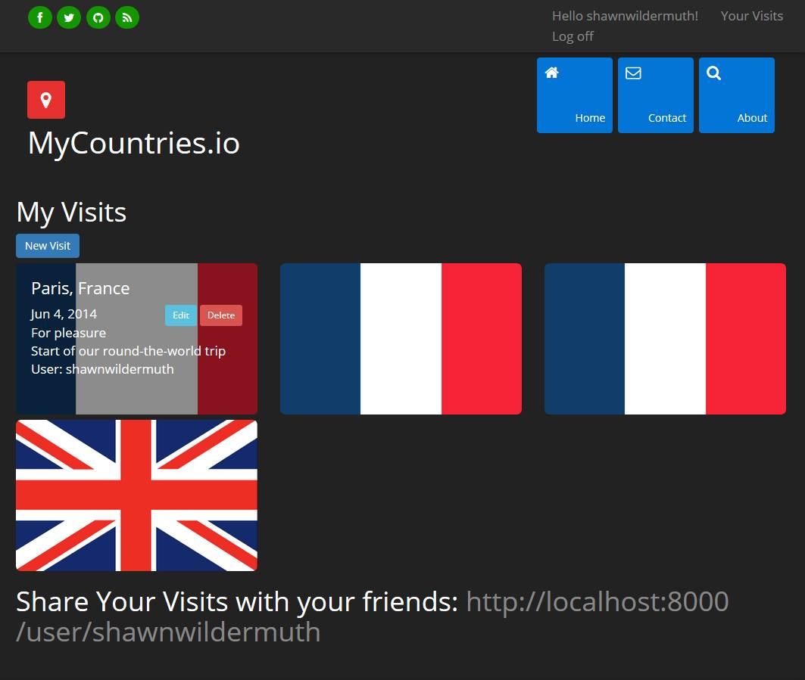

#My Countries#

This repository contains an early example of using ASP.NET 5 (e.g. vNext) and related technologies
to build a working website. The example allows users to add a list of countries visited and
share those countries with other users.

The purpose of the example is for my own investigation of Visual Studio 2015 and ASP.NET 5. The 
technologies used include:

* ASP.NET 5
* MVC 6
* AngularJS 1.3
* Bootstrap 3
* Entity Framework 7
* ASP.NET Identity
* Visual Studio 2015 RTM

The expectation is to keep this up to date at least until ASP.NET 5 
is released. Please enjoy.

Current version: ASP.NET 5 Beta 8

Screenshot:

